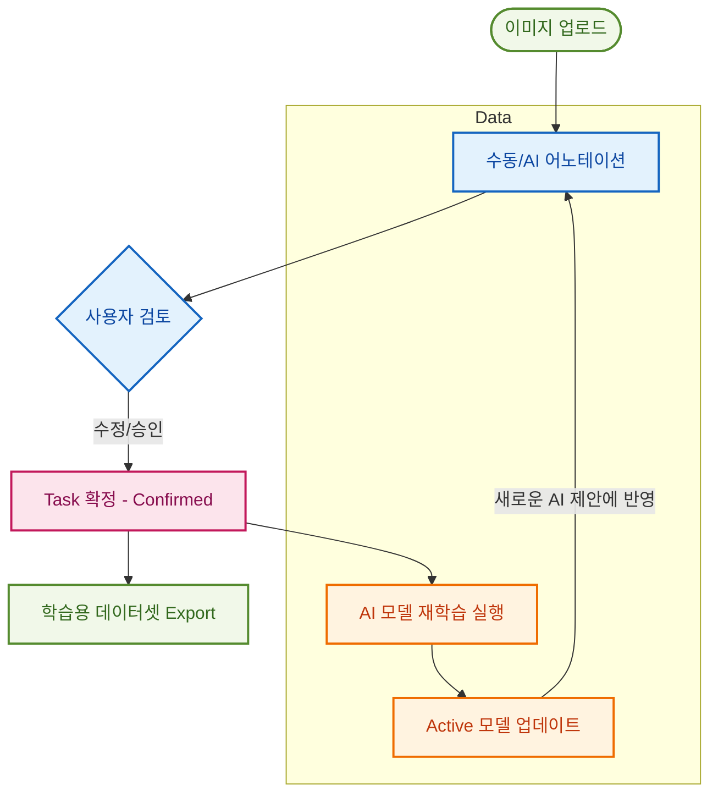

# 🎨 AI Collaborative Annotation Platform

**AI-assisted collaborative web-based image annotation platform.**
본 프로젝트는 AI 기반 제안 기능과 실시간 협업 기능을 결합한 웹 기반 이미지 어노테이션 플랫폼입니다.

---

## ✨ Platform Capabilities

본 플랫폼은 단순한 라벨링 도구를 넘어, **데이터 생산 → 모델 개선 → 재적용**의 전 과정을 통합한 **AI Lifecycle Management 시스템**입니다.

### 🧩 1. Project & Task Management

체계적인 데이터 관리를 위해 프로젝트와 태스크 단위를 논리적으로 분리합니다.

* **워크플로우 기반 상태 관리:** `TODO` → `IN_PROGRESS` → `CONFIRMED`
* **Confirmed** 상태의 데이터만 최종 학습 및 Export 대상으로 분류되어 데이터 품질을 보장합니다.


* **팀 협업:** 프로젝트 단위로 팀원을 초대하고 작업 권한을 제어합니다.

### 👥 2. Real-time Collaborative Annotation

여러 명의 작업자가 동시에 한 이미지에서 작업할 수 있는 환경을 제공합니다.

* **Live Presence:** 실시간 접속자 표시 및 **Live Cursor** 동기화.
* **Conflict Resolution:** 동시 수정 시 발생하는 충돌을 감지하고 최신 상태로 자동 재동기화합니다.
* **다양한 도구 지원:** Polygon, Bounding Box, Segmentation 등 필수 어노테이션 툴 제공.

### 🤖 3. AI-Powered Suggestion (Human-in-the-Loop)

AI가 먼저 제안하고 인간이 검토하는 방식으로 작업 속도를 획기적으로 개선합니다.

* **자동 객체 탐지:** Base 모델을 이용한 Bounding Box 및 Segmentation 자동 생성.
* **검토 워크플로우:** AI의 제안을 사용자가 수정/승인해야만 최종 데이터로 확정되는 안전장치를 둡니다.

### 🧠 4. Model Lifecycle Management (MLOps)

데이터가 쌓일수록 똑똑해지는 모델 성능 개선 루프를 지원합니다.

* **Fine-tuning:** 확정된(Confirmed) 데이터를 기반으로 모델 재학습 실행.
* **버전 관리:** 학습된 모델을 버전별로 관리하고, 특정 버전을 **Active 모델**로 설정하여 즉시 어노테이션에 투입할 수 있습니다.

### 🔄 5. Scalable Asynchronous Processing

대규모 데이터와 무거운 AI 연산을 안정적으로 처리하기 위한 아키텍처를 채택했습니다.

* **Kafka 기반 메시징:** 추론(Inference) 및 학습(Training) 요청을 큐잉하여 서버 부하를 분산합니다.
* **비동기 작업:** 작업 결과가 준비되면 알림을 통해 사용자에게 전달됩니다.

---

## 🏗 Integrated AI Workflow

플랫폼 내부에서 일어나는 데이터의 선순환 구조는 다음과 같습니다.



> **"데이터가 생산될수록 모델이 강력해지고, 강력해진 모델이 다시 데이터 생산 속도를 높입니다."**

---

## 🏗 Project Structure

```text
apps/
  api   → Spring Boot (Core backend)
  web   → Next.js (React UI)
  ai    → FastAPI (AI inference)

infra/
  docker-compose.yml

scripts/
  infra-up.sh
  infra-down.sh
  infra-reset.sh
  dev-api.sh
  dev-web.sh
  dev-ai.sh
```

---

## 🚀 Quick Start (Recommended – Script-Based)

가장 권장되는 개발 워크플로우입니다. 스크립트를 사용하여 복잡한 환경 설정을 최소화합니다.

### 1️⃣ Start Infrastructure

먼저 필요한 인프라(MySQL, MinIO, Kafka)를 실행합니다.

```bash
bash scripts/infra-up.sh
```

* **Stop:** `bash scripts/infra-down.sh`

> **♻️ Reset Infrastructure (Clean State)**
> DB 및 저장된 모든 데이터를 초기화하고 싶을 때 사용하세요. (Docker volumes 삭제)
> ```bash
> bash scripts/infra-reset.sh
> ```
> 
> 

### 2️⃣ Start API (Spring Boot)

```bash
bash scripts/dev-api.sh
```

* **URL:** [http://localhost:8080](https://www.google.com/search?q=http://localhost:8080)
* **Health:** [http://localhost:8080/actuator/health](https://www.google.com/search?q=http://localhost:8080/actuator/health)

### 3️⃣ Start AI Server (FastAPI)

**처음 실행하는 경우** 반드시 가상환경을 생성하고 의존성을 설치해야 합니다.

```bash
cd apps/ai

# 1. 가상환경 생성
python3 -m venv venv

# 2. 가상환경 활성화 (Mac/Linux)
source venv/bin/activate
# Windows (PowerShell) 사용 시: .\venv\Scripts\Activate.ps1

# 3. 의존성 설치
pip install -r requirements.txt

# 4. 서버 실행
uvicorn main:app --reload --port 8001
```

* **Swagger UI:** [http://localhost:8001/docs](https://www.google.com/search?q=http://localhost:8001/docs)
* *이후 실행 시에는 `source venv/bin/activate` 후 `uvicorn` 명령만 수행하면 됩니다.*

### 4️⃣ Start Frontend (Next.js)

```bash
bash scripts/dev-web.sh
```

* **URL:** [http://localhost:3000](https://www.google.com/search?q=http://localhost:3000)

---

## 🛠 Direct Manual Execution (Without Scripts)

### 🧱 1. Infrastructure (Docker)

```bash
# 실행
docker compose -f infra/docker-compose.yml up -d

# 중지 및 볼륨 초기화 (완전 리셋)
docker compose -f infra/docker-compose.yml down -v
```

### ☕ 2. Spring Boot API

```bash
cd apps/api
./gradlew bootRun --args='--spring.profiles.active=local'
```

* **IntelliJ IDEA 설정:**
* **Main class:** `AiAnnotationPlatformApplication`
* **VM options:** `-Dspring.profiles.active=local`


### 🌐 3. Next.js Web

```bash
cd apps/web
pnpm install
pnpm dev
```

---

## 🌍 Service Ports

| Service | Port | Description |
| --- | --- | --- |
| **Web** | 3000 | Next.js Frontend |
| **API** | 8080 | Spring Boot Backend |
| **AI** | 8001 | FastAPI AI Server |
| **MySQL** | 3306 | Database |
| **MinIO** | 9000 | Object Storage (S3 compatible) |
| **Kafka** | 29092 | Message Broker |

---