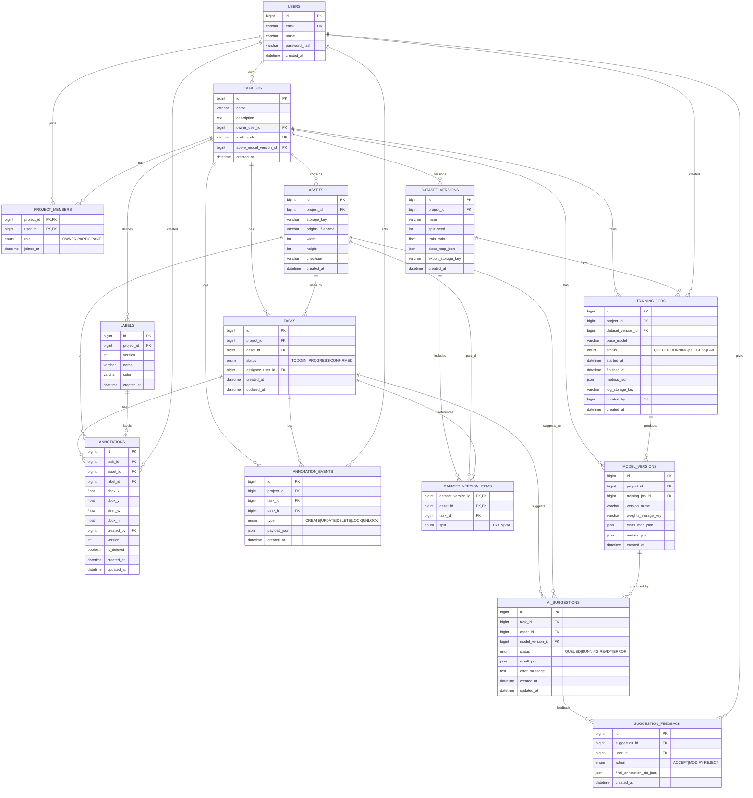

Entity Relationship Diagram

### **1) users**

- id (PK)
- email (UNIQUE)
- name
- password_hash (이건 인증 방식 따라서..?)
- created_at

### **2) projects**

- id (PK) → external id?
- name
- description(nullable)
- owner_user_id (FK → users.id)
- invite_code (UNIQUE, nullable)
- active_model_version_id (FK → model_versions.id, nullable)
- created_at

### **3) project_members**

- project_id (FK)
- user_id (FK)
- role (ENUM: OWNER, PARTICIPANT)
- joined_at
- PK: (project_id, user_id)

### **4) assets (이미지 단위)**

- id (PK)
- project_id (FK)
- storage_key (예: images/p123/a456.jpg)
- original_filename
- width, height
- checksum (중복 방지용, optional)
- created_at

### **5) tasks**

- id (PK)
- project_id (FK)
- asset_id (FK → assets.id)
- status (ENUM: TODO, IN_PROGRESS, CONFIRMED)
- assignee_user_id (FK → users.id, nullable)
- created_at, updated_at
- 인덱스: (project_id, status)

> 보통 “task = 이미지 1장”으로 가면 시스템이 단순해져. (makesense류도 보통 이 패턴)
> 

### **6) labels**

- id (PK)
- project_id (FK)
- version (INT)
- name (예: dog/cat/elephant)
- color (optional)
- created_at
- UNIQUE: (project_id, name)

### **7) annotations (정답)**

- id (PK)
- task_id (FK)
- asset_id (FK) ← task를 통해 알 수 있지만 조회 편의로 둬도 됨(선택)
- label_id (FK)
- bbox_x, bbox_y, bbox_w, bbox_h (FLOAT) ← **픽셀 or 정규화**
- created_by (FK → users.id)
- version (INT) ← 낙관적 락 (?)
- is_deleted (BOOL, soft delete)
- created_at, updated_at
- 인덱스: (task_id), (asset_id), (label_id)

### **8) annotation_events**

- id (PK)
- project_id (FK)
- task_id (FK)
- user_id (FK)
- type (ENUM: CREATE, UPDATE, DELETE, LOCK, UNLOCK 등)
- payload_json (JSON)
- created_at

> 협업/되돌리기/감사로그까지 챙기려면 이게 진짜 유리해. MVP에서도 “CREATE/UPDATE/DELETE만”이라도 저장하면 좋음.
> 

---

## **AI 파트(추론/재학습/버전관리)**

### **9) ai_suggestions (AI가 제안한 결과)**

- id (PK)
- task_id (FK)
- asset_id (FK)
- model_version_id (FK → model_versions.id)
- status (ENUM: QUEUED, RUNNING, READY, ERROR)
- result_json (JSON) ← 예: 여러 bbox 리스트
- error_message (nullable)
- created_at, updated_at

### **10) suggestion_feedback (사용자가 제안을 어떻게 처리했는지)**

- id (PK)
- suggestion_id (FK)
- user_id (FK)
- action (ENUM: ACCEPT, MODIFY, REJECT)
- final_annotation_ids_json (JSON, nullable) ← 수락/수정 결과가 어떤 annotation인지 연결
- created_at

---

## **학습 파트(데이터셋 스냅샷 / 학습잡 / 모델버전)**

### **11) dataset_versions**

- id (PK)
- project_id (FK)
- name (예: “confirmed_2026-02-14”)
- split_seed (INT)
- train_ratio (FLOAT) (예: 0.8)
- class_map_json (JSON) ← { "dog":0, "cat":1, "elephant":2 }
- export_storage_key (nullable) ← export zip을 저장한다면
- created_at

### **12) dataset_version_items**

- dataset_version_id (FK)
- asset_id (FK)
- task_id (FK)
- split (ENUM: TRAIN, VAL)
- PK: (dataset_version_id, asset_id)

> “이 모델은 dataset_version X로 학습했다”가 추적 가능해짐(재현성 핵심)
> 

### **13) training_jobs**

- id (PK)
- project_id (FK)
- dataset_version_id (FK)
- base_model (예: yolov8n.pt)
- status (QUEUED, RUNNING, SUCCESS, FAIL)
- started_at, finished_at
- metrics_json (nullable)
- log_storage_key (nullable)
- created_by (FK → users.id)
- created_at

### **14) model_versions**

- id (PK)
- project_id (FK)
- training_job_id (FK, nullable) ← 외부 모델 등록도 가능하게
- version_name (예: v1, v2)
- weights_storage_key (예: models/p123/v2/best.pt)
- class_map_json (JSON)
- metrics_json (JSON)
- created_at